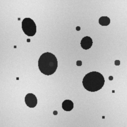
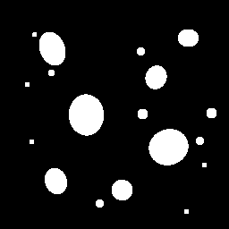
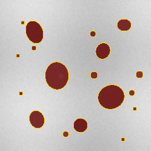

# PoroScope

[](https://github.com/utkuvibing/PoroScope/actions/workflows/tests.yml)

[](LICENSE)

PoroScope is an open-source Python toolkit for calibrated porosity analysis in microscopy and SEM microstructure images.

The current scope is deliberately narrow: reliable single-image and folder-level workflows from image loading to pore segmentation, calibrated measurements, and reproducible exports.

```text
image -> grayscale -> threshold -> pore mask -> cleanup -> measurements -> exports
```

## Current v0.1 Scope

Included:

- PNG, JPG/JPEG, and TIFF image loading.
- Grayscale conversion.
- Otsu and manual thresholding.
- Pore polarity selection with `--pores dark` or `--pores bright`.
- Small object removal and optional hole filling.
- Connected component labeling.
- Calibrated measurements with `--pixel-size` and `--unit`.
- Porosity percentage and per-pore measurement table.
- Mask, overlay, CSV, summary JSON, and config JSON export.
- Single-image CLI.
- Batch CLI with aggregate CSV/JSON summaries.
- Unit tests with synthetic images.

Not included in v0.1:

- napari plugin.
- Streamlit dashboard.
- HTML/PDF reports.
- Saved calibration profiles.
- Adaptive thresholding or CLAHE.
- Multiphase segmentation.
- Deep learning.
- Full ImageJ/Fiji validation.

## Example Output

The example below is fully synthetic and generated from `examples/generate_synthetic_example.py`. It is intended as a lightweight visual smoke test for the README, not as a validation dataset.

| Synthetic input | Binary pore mask | Detected pore overlay |
| --- | --- | --- |
|  |  |  |

For this synthetic image, PoroScope detects dark pore-like regions in a bright matrix and exports the mask, overlay, per-pore table, summary JSON, and reproducibility config.

Summary excerpt:

```json
{
  "porosity_percent": 9.4345,
  "pore_count": 18,
  "pixel_size": 0.5,
  "unit": "um",
  "threshold_method": "otsu",
  "pores": "dark"
}
```

Measurement CSV excerpt:

```text
label,area_px,area_unit2,equivalent_diameter_px,equivalent_diameter_unit,touches_border
1,367.0,91.75,21.62,10.81,False
2,24.0,6.0,5.53,2.76,False
3,859.0,214.75,33.07,16.54,False
```

## Installation

From a local checkout:

```bash
pip install -e ".[test]"
```

## CLI Quick Start

Analyze an image with Otsu thresholding:

```bash
poroscope analyze image.tif --pixel-size 0.5 --unit um --pores dark --output results/
```

Batch-analyze all supported images in a folder:

```bash
poroscope batch images/ \
  --pixel-size 0.5 \
  --unit um \
  --pores dark \
  --threshold otsu \
  --min-size 20 \
  --fill-holes \
  --output results/ \
  --overwrite
```

Batch mode processes PNG, JPG/JPEG, and TIFF files directly inside the input folder. Unsupported files are skipped. Images that fail during analysis are recorded in `batch_summary.json`, and processing continues for the remaining images.

Analyze bright pores with a manual threshold:

```bash
poroscope analyze image.tif \
  --pixel-size 0.5 \
  --unit um \
  --pores bright \
  --threshold manual \
  --threshold-value 128 \
  --output results/
```

Manual threshold values are expressed in the internal 0-255 intensity range. PoroScope converts input images to grayscale and normalizes intensities to 0-255 before thresholding, regardless of the original image dtype.

Crop away scale bars, labels, or SEM metadata before analysis:

```bash
poroscope analyze image.tif \
  --pixel-size 0.5 \
  --unit um \
  --pores dark \
  --crop 0 0 1024 900 \
  --output results/
```

Crop format is `x y width height`, in pixels. The crop is applied before thresholding and all reported measurements refer to the cropped analysis region.

By default, PoroScope refuses to write into an existing result folder such as `results/image/`. Use `--overwrite` only when you intentionally want to replace the existing output files:

```bash
poroscope analyze image.tif --pixel-size 0.5 --unit um --pores dark --output results/ --overwrite
```

## Calibration

Use `--pixel-size` to provide the physical length represented by one pixel.

Example:

```text
--pixel-size 0.5 --unit um
```

This means each pixel is `0.5 um` wide. Lengths are multiplied by `pixel_size`; areas are multiplied by `pixel_size^2`.

## Pore Polarity

Pores can appear dark or bright depending on imaging mode and preprocessing.

- `--pores dark`: pixels below the threshold are pores.
- `--pores bright`: pixels above the threshold are pores.

For manual thresholding, the threshold is applied after grayscale conversion and 0-255 normalization.

## Output Files

For `image.tif`, PoroScope writes:

```text
results/
└── image/
    ├── image_mask.tif
    ├── image_overlay.png
    ├── image_measurements.csv
    ├── image_summary.json
    └── image_config.json
```

The CSV contains one row per detected pore. If no pores are detected, PoroScope writes a valid CSV with headers and zero rows.

Batch mode also writes aggregate files in the selected output directory:

```text
results/
├── batch_summary.csv
├── batch_summary.json
├── image_a/
│   ├── image_a_mask.tif
│   ├── image_a_overlay.png
│   ├── image_a_measurements.csv
│   ├── image_a_summary.json
│   └── image_a_config.json
└── image_b/
    └── ...
```

The aggregate CSV includes per-image porosity, pore count, pixel counts, pore area statistics, and output folder paths.

## Important Input Guidance

Do not include scale bars, image labels, microscope overlays, or SEM metadata bands in the analyzed region. These features can be segmented as pores and bias porosity. Use `--crop` or pre-crop images before analysis.

## Limitations

PoroScope v0.1 performs binary 2D porosity analysis only. Results depend on image quality, threshold choice, and calibration accuracy. It does not infer 3D porosity from 2D sections and does not replace domain review of segmentation quality.

## Roadmap

- v0.2: batch processing, reusable config files, improved examples.
- v0.3: napari plugin and interactive threshold preview.
- v0.4: HTML reports, saved calibration profiles, validation datasets.
- v1.0: stable API, documentation site, archived DOI release, publication-ready validation.

Suggested GitHub topics:

```text
materials-science image-analysis porosity microscopy sem scientific-python scikit-image materials-characterization
```

## Citation

If you use PoroScope in academic work, please cite the archived release once available. Citation metadata is provided in `CITATION.cff` and will be updated for release DOI metadata.

## License

PoroScope is released under the BSD-3-Clause license.
